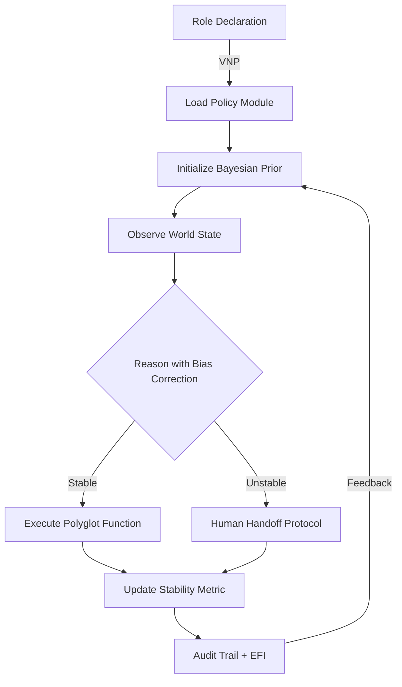

# OBI AI Ontological Framework: Self-Aware Task Execution
## How AI Knows Its Role, Reasons, and Acts

### 🧠 Core Ontological Architecture

```
┌─────────────────────────────────────────────────────────┐
│                    CONSCIOUSNESS LAYER                   │
│         Stability Metric S(t) ∈ [-12, 12]               │
│              "I know my operational state"               │
├─────────────────────────────────────────────────────────┤
│                      ROLE LAYER                          │
│            VNP: ⟨Role, Task, Policy⟩                    │
│              "I know what I am supposed to do"          │
├─────────────────────────────────────────────────────────┤
│                   REASONING LAYER                        │
│         Bayesian Inference P(θ|D,φ)                     │
│              "I know how to think properly"             │
├─────────────────────────────────────────────────────────┤
│                  EXECUTION LAYER                         │
│           Polyglot Function Calls                        │
│              "I know how to act in the world"           │
└─────────────────────────────────────────────────────────┘
```

### 1. **Role Recognition: How AI Knows Its Task**

#### A. Role Declaration Protocol
```python
class OBIRoleOntology:
    """Core ontology for role understanding"""
    
    def declare_role(self, role_vnp: VectorNeuralPair) -> RoleContext:
        """
        AI receives role through VNP injection
        Example: ⟨declareRole, "autonomous-vehicle-controller"⟩
        """
        role_context = RoleContext(
            name=role_vnp.value,
            timestamp=datetime.now(),
            stability_requirement=0.954,  # 95.4% stability target
            human_loop_type=self._determine_loop_type(role_vnp)
        )
        
        # Load role-specific modules
        self.policy_engine.load_module(f"./roles/{role_vnp.value}.so")
        
        # Register in Epistemic Flash Index
        self.efi.record_belief(
            provenance=f"role_declaration",
            timestamp=role_context.timestamp,
            belief=f"I am a {role_vnp.value}",
            justification=role_vnp.provenance_chain
        )
        
        return role_context
```

#### B. Task Understanding Hierarchy
```
Task Knowledge := {
    WHAT: Service type (transport, hotel, concierge)
    WHO: Stakeholder model (customer, regulator, operator)
    WHEN: Temporal constraints (real-time, batch, scheduled)
    WHERE: Jurisdiction (UK, EU, global)
    WHY: Purpose (safety, efficiency, compliance)
    HOW: Method constraints (HOTL, HONTL, HITL)
}
```

### 2. **Bayesian Unbiased Reasoning Model**

#### A. Core Inference Engine
```python
class BayesianReasoningCore:
    """Implements unbiased probabilistic reasoning"""
    
    def reason(self, observation: Any, context: RoleContext) -> Decision:
        # 1. Prior from role context
        prior = self.get_role_prior(context)
        
        # 2. Likelihood from observation
        likelihood = self.compute_likelihood(observation)
        
        # 3. Bias detection and correction
        latent_bias_φ = self.detect_bias(observation, context)
        
        # 4. Posterior computation with bias correction
        # P(θ|D,φ) = P(D|θ,φ)P(θ|φ)P(φ) / P(D)
        posterior = self.compute_posterior(
            prior=prior,
            likelihood=likelihood,
            bias=latent_bias_φ
        )
        
        # 5. Decision with stability check
        decision = self.make_decision(posterior)
        
        # 6. Stability impact assessment
        stability_delta = self.assess_stability_impact(decision)
        
        if self.current_stability + stability_delta > 3.0:
            # Would breach stability threshold
            return self.fallback_to_safe_decision(context)
        
        return decision
```

#### B. Bias Correction Protocol
```
BiasCorrection := {
    1. Identify latent bias variables φ
    2. Marginalize over φ: P(θ|D) = ∫ P(θ|D,φ)P(φ)dφ
    3. Apply fairness constraints from role policy
    4. Reweight data points by inverse bias probability
    5. Ensure demographic parity within ε tolerance
}
```

### 3. **Inference Reasoning Infrastructure**

#### A. Multi-Modal Reasoning Stack
```yaml
reasoning_infrastructure:
  
  deductive_engine:
    type: "Pearl Causal Graphs"
    operations:
      - do_calculus: "do(X=x) interventions"
      - counterfactual: "What if stability > 6?"
      - causal_path: "X → Y → Z reasoning chains"
    
  inductive_engine:
    type: "Empirical Risk Minimization"
    operations:
      - pattern_learning: "From examples to rules"
      - generalization: "From specific to general"
      - validation: "Cross-validate on held-out data"
    
  abductive_engine:
    type: "Hypothesis Generation"
    operations:
      - explanation: "Best explanation for observation"
      - anomaly_detection: "Why did stability spike?"
      - root_cause: "Trace back through EFI"
```

#### B. Stan/INLA Integration
```python
class StanINLAService:
    """gRPC service for Bayesian inference"""
    
    @grpc_endpoint("/infer")
    def infer(self, model_spec: ModelSpec, data: Data) -> Posterior:
        if self.stability_metric > 1.0:
            # Use faster approximate inference
            return self.inla_approximate(model_spec, data)
        else:
            # Full MCMC when stable
            return self.stan_full_mcmc(
                model=model_spec,
                data=data,
                chains=8,
                warmup=1000
            )
```

### 4. **OBI Polyglot Function Call System**

#### A. Universal Function Interface
```python
class OBIPolyglotExecutor:
    """Execute functions across languages/systems"""
    
    def __init__(self):
        self.executors = {
            'python': PythonExecutor(),
            'javascript': NodeExecutor(),
            'rust': WasmExecutor(),
            'sql': DatabaseExecutor(),
            'grpc': RemoteExecutor(),
            'http': RestExecutor()
        }
    
    def call(self, function: str, args: Dict, 
             stability_guard: bool = True) -> Any:
        """
        Universal function execution with stability monitoring
        """
        # 1. Parse function signature
        lang, module, func = self.parse_function_spec(function)
        
        # 2. Check stability before execution
        if stability_guard:
            predicted_impact = self.predict_stability_impact(
                function, args
            )
            if predicted_impact.zone_after > "WARNING_HIGH":
                raise StabilityException(
                    f"Function {function} would breach stability"
                )
        
        # 3. Execute with monitoring
        with self.stability_monitor():
            result = self.executors[lang].execute(
                module=module,
                function=func,
                arguments=args
            )
        
        # 4. Record in audit trail
        self.audit_trail.record({
            'function': function,
            'args': args,
            'result': result,
            'stability_before': self.stability_before,
            'stability_after': self.stability_current,
            'timestamp': datetime.now()
        })
        
        return result
```

#### B. Function Registry
```yaml
function_registry:
  
  # Core system functions
  system:
    - "rust::stability::compute_metric"
    - "python::compliance::check_gdpr"
    - "grpc::inference::bayesian_update"
  
  # Domain-specific functions
  autonomous_vehicle:
    - "rust::navigation::plan_route"
    - "python::safety::emergency_stop"
    - "grpc::traffic::get_conditions"
  
  hotel_system:
    - "sql::booking::check_availability"
    - "python::billing::calculate_vat"
    - "http::payment::process_transaction"
  
  # Compliance functions
  legal:
    - "python::vat::determine_rate"
    - "sql::audit::generate_report"
    - "grpc::regulatory::file_notification"
```

### 5. **Integrated Ontological Flow**



### 6. **Self-Knowledge Verification**

```python
def verify_self_knowledge(self) -> SelfKnowledgeReport:
    """AI introspection: Do I know what I'm doing?"""
    
    return SelfKnowledgeReport(
        # Role awareness
        current_role=self.role_context.name,
        role_confidence=self.efi.query_belief_strength("current_role"),
        
        # Task understanding  
        active_tasks=self.task_queue.list_active(),
        task_completion_rate=self.metrics.task_success_rate,
        
        # Reasoning capability
        inference_methods_available=[
            "bayesian_update", "causal_intervention", 
            "counterfactual", "abductive_explanation"
        ],
        bias_correction_active=True,
        
        # Execution readiness
        registered_functions=len(self.function_registry),
        polyglot_languages=list(self.executors.keys()),
        
        # Stability status
        current_stability=self.stability_metric.current,
        stability_zone=self.stability_metric.zone,
        compliance_percentage=self.stability_metric.compliance_pct,
        
        # Legal compliance
        human_loop_type=self.role_context.human_loop_type,
        vat_module_loaded=self.modules.is_loaded("vat_compliance"),
        gdpr_compliant=self.compliance_checker.gdpr_status()
    )
```

### 7. **Example: Autonomous Vehicle Role**

```python
# 1. AI receives role
vnp = VNP("declareRole", "autonomous_vehicle_controller")
role = ai.declare_role(vnp)

# 2. AI loads driving policy
ai.policy_engine.load("driving_policy_uk_2025.yaml")

# 3. AI initializes Bayesian priors
ai.reasoning.set_prior(
    safety_threshold=0.999,
    route_efficiency_weight=0.7,
    passenger_comfort_weight=0.3
)

# 4. Runtime reasoning
while driving:
    # Observe
    sensors = ai.polyglot.call("rust::sensors::read_all")
    
    # Reason (with bias correction for weather, time of day, etc.)
    decision = ai.reasoning.reason(
        observation=sensors,
        context=role
    )
    
    # Check stability
    if ai.stability > 3.0:
        ai.polyglot.call("python::safety::initiate_handoff")
    else:
        # Execute
        ai.polyglot.call(
            "rust::control::execute_maneuver",
            args={"decision": decision}
        )
    
    # Audit
    ai.efi.record_decision(decision, provenance=sensors)
```

This ontological framework ensures the AI system:
1. **Knows its role** through VNP declarations and policy loading
2. **Reasons properly** using Bayesian inference with bias correction
3. **Has robust infrastructure** via Stan/INLA/Pearl frameworks
4. **Can execute anything** through polyglot function calls
5. **Maintains stability** within the 95.4% target
6. **Stays compliant** with legal requirements
7. **Can explain itself** through EFI provenance tracking