# OBI Legal Compliance Implementation Guide
## Practical Enforcement for Human-Out/On-the-Loop Systems

### Version 2.0 - August 2025
### OBINexus Legal & Technical Division

---

## 🎯 Quick Reference: System Classification & Compliance

### System Type Matrix

| System Type | Human Involvement | VAT Treatment | Liability Model | Min Insurance |
|-------------|------------------|---------------|-----------------|---------------|
| **HOTL Self-Driving** | None (Level 5) | Standard Rate | Strict Liability | €50M |
| **HONTL Self-Driving** | Monitoring (Level 3-4) | Standard Rate | Shared Liability | €25M |
| **HOTL Hotel** | Post-facto review | Standard Rate | Operator Liability | €10M |
| **HONTL Hotel** | Real-time override | Standard Rate | Negligence-based | €5M |

---

## 📊 Stability-Based Compliance Matrix

### Real-Time Enforcement Rules

```python
def enforce_compliance(stability_metric, system_type, vat_status):
    """
    Core compliance enforcement based on stability zones
    """
    if stability_metric.zone == "STABLE":
        # S(t) = 0: Normal operations
        actions = {
            "service": "CONTINUE",
            "vat": "PROCESS_NORMALLY",
            "audit": "STANDARD_LOGGING",
            "user_notice": None
        }
    
    elif stability_metric.zone in ["WARNING_LOW", "WARNING_MED"]:
        # S(t) ∈ (0, 2]: Enhanced monitoring
        actions = {
            "service": "CONTINUE_WITH_MONITORING",
            "vat": "FLAG_TRANSACTION",
            "audit": "ENHANCED_LOGGING",
            "user_notice": "TRANSPARENT_AI_NOTICE"
        }
    
    elif stability_metric.zone == "WARNING_HIGH":
        # S(t) ∈ (2, 3]: Prepare for handoff
        actions = {
            "service": "PREPARE_HUMAN_HANDOFF",
            "vat": "HOLD_PROCESSING",
            "audit": "INCIDENT_PRELOG",
            "user_notice": "HUMAN_AVAILABLE_NOTICE"
        }
    
    elif stability_metric.zone in ["DANGER_LOW", "DANGER_MED"]:
        # S(t) ∈ (3, 6]: Mandatory intervention
        actions = {
            "service": "INITIATE_HANDOFF" if system_type == "HOTL" else "HUMAN_OVERRIDE",
            "vat": "SUSPEND_AI_CHARGES",
            "audit": "LEGAL_NOTIFICATION",
            "user_notice": "MANDATORY_HUMAN_TAKEOVER"
        }
    
    else:  # CRITICAL, PANIC zones
        # S(t) > 6: Emergency protocols
        actions = {
            "service": "EMERGENCY_STOP",
            "vat": "VOID_TRANSACTION",
            "audit": "REGULATORY_ALERT",
            "user_notice": "EMERGENCY_SHUTDOWN"
        }
    
    return actions
```

---

## 💰 VAT Compliance Integration

### Transaction Processing Flow

```mermaid
graph TD
    A[Service Request] --> B{Stability Check}
    B -->|S ≤ 3| C[Process VAT]
    B -->|S > 3| D[Hold Transaction]
    C --> E[Generate Invoice]
    D --> F{Human Intervention}
    F -->|Success| G[Adjusted VAT Rate]
    F -->|Failure| H[Void & Refund]
    E --> I[Audit Trail]
    G --> I
    H --> I
```



### VAT Invoice Requirements

```json
{
  "invoice_template": {
    "header": {
      "supplier_vat": "GB123456789",
      "invoice_number": "OBI-20250825-A1B2C3",
      "date": "2025-08-25T14:30:00Z"
    },
    "ai_disclosure": {
      "system_type": "HOTL",
      "stability_at_service": 0.45,
      "human_oversight_available": true,
      "ai_decision_percentage": 100
    },
    "line_items": [
      {
        "description": "Autonomous Vehicle Journey - London to Birmingham",
        "ai_component": true,
        "human_backup_included": true,
        "net_amount": 85.00,
        "vat_rate": 0.20,
        "vat_amount": 17.00,
        "total": 102.00
      }
    ],
    "compliance_statement": "This service was provided by an AI system operating within OBI stability parameters. Human oversight was available throughout. Full audit trail available upon request."
  }
}
```

---

## 🚗 Self-Driving Car Compliance

### HOTL (Level 5) Requirements

1. **Pre-Journey Compliance Check**
   ```python
   def pre_journey_check():
       stability = get_current_stability()
       insurance = verify_insurance_coverage()
       passenger_consent = obtain_gdpr_consent()
       
       if stability > 1.0:
           return "REQUIRE_HUMAN_DRIVER"
       elif not insurance.is_valid():
           return "JOURNEY_PROHIBITED"
       elif not passenger_consent:
           return "CONSENT_REQUIRED"
       else:
           return "JOURNEY_AUTHORIZED"
   ```

2. **Real-Time Monitoring**
   - Stability logged every 100ms
   - Automatic speed reduction if S > 2
   - Emergency stop locations identified if S > 3
   - Black box recording for 5 years

3. **Passenger Rights Display**
   ```
   ┌─────────────────────────────────────┐
   │     AI AUTONOMOUS VEHICLE           │
   │  Current Stability: ●●●○○ (0.3)     │
   │  Human Override: Available          │
   │  Emergency Stop: Press Red Button   │
   │  Support Line: 0800-AI-HELP         │
   └─────────────────────────────────────┘
   ```

### HONTL (Level 3-4) Requirements

1. **Driver Attention Monitoring**
   - Hands-on-wheel detection
   - Eye tracking for alertness
   - Takeover readiness score
   - Progressive warnings at S > 1

2. **Handoff Protocol**
   ```python
   def initiate_handoff(stability_metric):
       warning_time = max(10 - stability_metric * 2, 3)  # seconds
       
       display_warning(f"Take control in {warning_time} seconds")
       haptic_alert()
       audio_warning()
       
       if not driver_responds_in_time():
           execute_minimum_risk_maneuver()
           notify_emergency_services()
   ```

---

## 🏨 Hotel System Compliance

### HOTL Automated Check-in

1. **Guest Interaction Flow**
   ```
   Welcome → AI Disclosure → Service Choice → Stability Check → Process
   ```

2. **Mandatory Disclosures**
   - "This check-in is powered by AI"
   - "Human staff available 24/7"
   - "Current system stability: NORMAL"
   - "Press HELP for human assistance"

3. **VAT Processing**
   ```python
   def process_hotel_vat(booking_details, stability):
       base_rate = Decimal("0.20")  # UK standard
       
       if stability > 3:
           # Switch to human processing
           return redirect_to_human_staff()
       
       invoice_lines = [
           {
               "description": "Room - AI Processed Booking",
               "nights": booking_details.nights,
               "rate": booking_details.room_rate,
               "vat_rate": base_rate
           }
       ]
       
       if booking_details.includes_ai_concierge:
           invoice_lines.append({
               "description": "AI Concierge Service",
               "amount": 10.00,
               "vat_rate": base_rate
           })
       
       return generate_vat_invoice(invoice_lines)
   ```

### HONTL Assisted Operations

1. **Staff Dashboard Requirements**
   ```
   ┌──────────────────────────────────────────┐
   │ AI ASSISTANCE PANEL                      │
   ├──────────────────────────────────────────┤
   │ Current Stability: 0.23 [STABLE]         │
   │ Active AI Decisions: 3                   │
   │ Pending Reviews: 1                       │
   │ Override History: View                   │
   ├──────────────────────────────────────────┤
   │ [APPROVE ALL] [REVIEW] [TAKE CONTROL]    │
   └──────────────────────────────────────────┘
   ```

2. **Decision Audit Trail**
   - AI recommendation
   - Human action taken
   - Time to decision
   - Stability at decision point
   - Guest outcome

---

## 📱 User Interface Requirements

### Mandatory UI Elements

1. **AI Status Indicator**
   ```html
   <div class="ai-status-indicator">
     <span class="stability-badge" data-level="stable">
       🤖 AI Active - Stability: Normal
     </span>
     <button class="human-request">Request Human</button>
   </div>
   ```

2. **Real-Time Stability Display**
   - Green (S = 0): "AI Operating Normally"
   - Yellow (S < 3): "AI Monitoring Active"
   - Orange (S < 6): "Human Oversight Engaged"
   - Red (S > 6): "Human Control Active"

3. **Emergency Override**
   - Physical button in vehicles
   - Prominent UI button in digital interfaces
   - Voice command: "HUMAN HELP"
   - Automatic activation at S > 9

---

## 📋 Implementation Checklist

### Technical Integration
- [ ] Stability metric API endpoint active
- [ ] Real-time monitoring dashboard deployed
- [ ] VAT module integrated with billing system
- [ ] Audit logging to immutable storage
- [ ] Emergency protocols tested weekly
- [ ] Black box recorder certified

### Legal Compliance
- [ ] GDPR consent forms updated
- [ ] EU AI Act assessment completed
- [ ] Insurance policies verified
- [ ] Terms of service reviewed by counsel
- [ ] Regulatory registrations current
- [ ] Data retention policies implemented

### Operational Readiness
- [ ] Staff trained on handoff procedures
- [ ] User communication templates approved
- [ ] Incident response team on-call 24/7
- [ ] Compliance officer has dashboard access
- [ ] Monthly compliance audits scheduled
- [ ] Customer support scripts updated

### Financial Systems
- [ ] VAT calculation engine tested
- [ ] Invoice templates approved by tax advisor
- [ ] Refund mechanisms automated
- [ ] Audit trail meets HMRC requirements
- [ ] Cross-border VAT rules configured
- [ ] Making Tax Digital API connected

---

## 🚨 Emergency Response Protocols

### Stability Breach (S > 6) Response

```
T+0s: Breach detected
T+1s: Automated safety measures engaged
T+5s: Human operator alerted
T+30s: Service suspended/degraded
T+2min: Legal team notified
T+5min: Initial assessment complete
T+30min: Customer communications sent
T+24hr: Regulatory filing (if required)
T+72hr: Full incident report
```

### Kill Switch Activation (S > 10.5)

1. **Immediate Actions**
   - All AI decisions frozen
   - Human control mandatory
   - Emergency services notified
   - Insurance carrier alerted

2. **Customer Protection**
   - Automatic full refunds
   - Alternative service arranged
   - Direct human contact provided
   - Compensation processed

3. **Recovery Protocol**
   - Root cause analysis
   - System recertification
   - Regulatory approval
   - Phased reactivation

---

## 📊 Compliance Reporting

### Monthly VAT Return

```python
def generate_monthly_vat_return():
    return {
        "period": "2025-08",
        "ai_transactions": {
            "hotl_count": 1523,
            "hontl_count": 3421,
            "total_vat_collected": 125431.23,
            "average_stability": 0.34,
            "breaches": 2,
            "human_interventions": 47
        },
        "compliance_metrics": {
            "stability_target_met": True,  # 95.4%
            "gdpr_compliance": 100,
            "audit_trail_complete": True
        }
    }
```

### Regulatory Reporting

- EU AI Act: Quarterly
- GDPR: Incident-based
- VAT: Monthly
- Insurance: Annual
- Consumer Protection: As required

---

## 💡 Best Practices

1. **Always Err on the Side of Caution**
   - If stability > 1, increase monitoring
   - If stability > 3, prepare for handoff
   - If stability > 6, mandate human control

2. **Transparency First**
   - Clear AI labeling
   - Real-time status visible
   - Human option always available

3. **Documentation Excellence**
   - Every decision logged
   - Stability recorded continuously
   - User interactions preserved

4. **Regular Testing**
   - Weekly handoff drills
   - Monthly compliance audits
   - Quarterly regulatory reviews

---

## 📞 Support Contacts

- **OBI AI Safety Hotline**: +44-800-OBI-SAFE
- **Legal Compliance**: legal@obinexus.org
- **Technical Support**: support@obinexus.org
- **VAT Queries**: tax@obinexus.org
- **Emergency**: 999 / 112

---

**Remember**: The 95.4% stability target is not just a number—it's our commitment to safe, compliant, and trustworthy AI services. When in doubt, hand over to humans.